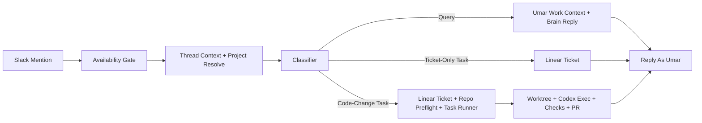

# overlap-guard

Slack-based delegate backend for Umar.

## What It Does

- replies on Umar's behalf in Slack when he is unavailable
- classifies mentions into `query`, `ticket_only_task`, or `code_change_task`
- answers "what is Umar working on?" from Umar's own Linear and GitHub context
- creates Linear tasks for work requests
- can prepare an isolated git worktree, run Codex locally on the Mac mini, commit, push, and open a PR
- logs observations and can refresh `memory/ROLE.md`, `memory/SKILL.md`, and `memory/SOUL.md`

## Core Runtime Flow

## Environment

Required:
- `SLACK_SIGNING_SECRET`
- `SLACK_BOT_TOKEN`
- `SLACK_USER_TOKEN`
- `SLACK_MY_USER_ID`
- `SLACK_TEAM_ID`
- `OPENAI_API_KEY`
- `GITHUB_TOKEN`
- `LINEAR_API_KEY`

Optional but important for production:
- `AUTO_CREATE_LINEAR_TASKS=true`
- `PROJECT_SEARCH_ROOTS=/Users/umar_cpp/Documents/github`
- `TASK_EXECUTION_ENABLED=true`
- `TASK_COMMIT_ENABLED=true`
- `TASK_PUSH_ENABLED=true`
- `TASK_CREATE_PR_ENABLED=true`
- `CODEX_CLI_PATH=/Applications/Codex.app/Contents/Resources/codex`
- `CODEX_EXEC_MODEL=...`
- `CODEX_DANGEROUSLY_BYPASS_SANDBOX=true`
- `SLACK_DEBUG_AUTO_REPLY=true`
- `SLACK_ALLOW_SELF_TEST=true`
- `GOOGLE_AI_API_KEY=...`
- `GOOGLE_IMAGE_MODEL=gemini-3.1-flash-image-preview`

If `TASK_EXECUTOR_COMMAND` is not set, the app uses local `codex exec` by default.

## Project Registry

Repos are auto-discovered from:
- `/Users/umar_cpp/Documents/GitHub`
- `/Users/umar_cpp/Documents/github`

You can optionally add overrides in [projects/registry.json](/Users/umar_cpp/Documents/GitHub/overlap-guard/projects/registry.json) for:
- `linearTeamId`
- `linearProjectId`
- `baseBranch`
- `testCommand`

If no override is present, the app uses the discovered repo path and auto-detects the base branch from `origin/HEAD`, then falls back to `main`, then `staging`.

## Task Run Folders

Each Slack thread that becomes a task gets a durable run folder in:

- `/Users/umar_cpp/Documents/GitHub/overlap-guard/data/task-runs/<channel>__<thread_ts>/<runId>`

These folders store:
- task context
- Codex prompt
- Codex structured result
- stdout/stderr logs
- changed files
- check results
- commit/push/PR metadata

That means future follow-up changes for the same Slack thread can be traced back to the same thread folder.

## Scripts

- `npm start`
- `npm run typecheck`
- `npm run refresh-memory`
