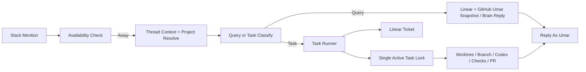
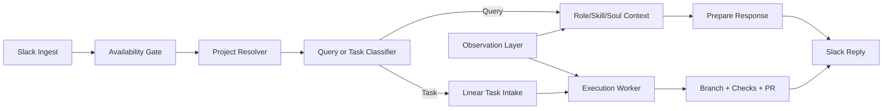

# Delegate Automation Roadmap

## Current State

Implemented:
- Slack ingest
- away-status activation
- reply-as-Umar via Slack user token
- self-test mode
- debug logging
- native Slack assistant loader
- thread-context retrieval
- Umar-only work summary from Linear and GitHub identity
- single active task lock
- per-thread task run folders
- task orchestration foundation for ticket, branch, Codex execution, checks, push, and PR
- observation logging and memory refresh script

New foundation in this repo:
- project registry
- role / skill / soul memory files
- query vs task classifier
- Linear task creation for task messages
- local Codex executor integration
- optional external executor override via `TASK_EXECUTOR_COMMAND`

## Diagrams

### Current

### Target

## Recommended Architecture

1. Slack ingress
2. availability gate
3. thread context retrieval
4. project resolver
5. query/task classifier
6. Umar-focused query reply or task orchestration
7. observation refresh
8. local Codex execution on the Mac mini
9. branch, checks, push, and PR creation

## Observation Layer

Primary observation sources:
- Slack replies
- Linear ticket creation and comments
- GitHub commits, PRs, and review comments
- project/channel mapping updates

Recommended refresh cadence:
- lightweight event logging continuously
- memory refresh twice daily

Memory outputs:
- `memory/ROLE.md`
- `memory/SKILL.md`
- `memory/SOUL.md`

## GitHub PR Flow

Current execution path for task messages:
1. classify as task
2. resolve project from registry
3. create/update Linear issue
4. acquire the single active-task lock
5. create a durable task-run folder for the Slack thread
6. locate repo local path or search in `PROJECT_SEARCH_ROOTS`
7. create isolated git worktree and branch
8. write Codex prompt and schema artifacts
9. run local `codex exec` by default
10. or run `TASK_EXECUTOR_COMMAND` if explicitly configured
11. run tests / checks
12. commit
13. push branch
14. create PR to `staging` or configured base branch
15. send final Slack update with PR link and task-run folder reference

## Project Resolution Strategy

Use a weighted combination of:
- Slack channel mapping
- project keywords
- repo names
- linked issue / PR references
- thread history

## Model Strategy

- OpenAI text brain: `gpt-5-mini` by default
- OpenAI classifier: `gpt-5-mini`
- Current coding worker: local `codex exec` on the Mac mini
- Optional override: `TASK_EXECUTOR_COMMAND`
- Google image/screen analysis: use `gemini-3.1-flash-image-preview` or whatever current image model is configured

## Safety

- never auto-push to production branches
- prefer PRs to `staging`
- use isolated git worktrees instead of mutating the base repo checkout
- keep task creation traceable in Linear
- keep observation summaries editable and versioned

## Required Production Config

- Add `localPath` for each repo in `projects/registry.json`, or set `PROJECT_SEARCH_ROOTS`
- Make sure the local Codex CLI is installed and logged in on the Mac mini
- Optionally set `CODEX_EXEC_MODEL` if you want to pin the execution model
- Add `testCommand` per project if you want automatic checks
- Keep `AUTO_CREATE_LINEAR_TASKS=true` if you want task creation without manual prompts

## Task Run Organization

Every task-producing Slack thread gets its own folder under:
- `data/task-runs/<channel>__<thread_ts>/`

Every execution attempt inside that thread gets its own run subfolder:
- `data/task-runs/<channel>__<thread_ts>/<runId>/`

This is the local audit trail and the easiest place to revisit the same Slack task later.
