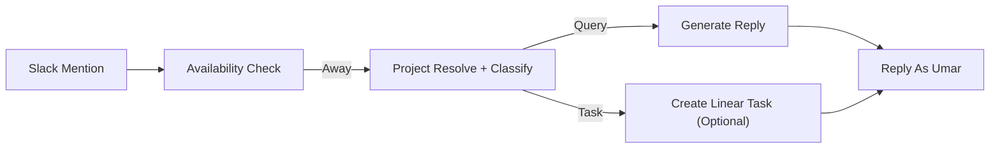
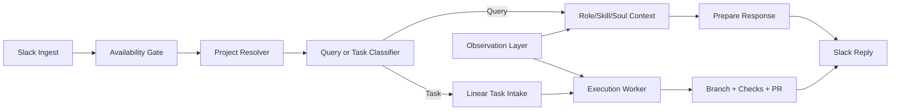

# Delegate Automation Roadmap

## Current State

Implemented:
- Slack ingest
- away-status activation
- reply-as-Umar via Slack user token
- self-test mode
- debug logging

New foundation in this repo:
- project registry
- role / skill / soul memory files
- query vs task classifier
- optional Linear task creation for task messages

## Diagrams

### Current

### Target

## Recommended Architecture

1. Slack ingress
2. availability gate
3. project resolver
4. query/task classifier
5. query reply or task intake
6. observation refresh
7. later: code execution, branch creation, PR creation

## Observation Layer

Primary observation sources:
- Slack replies
- Linear ticket creation and comments
- GitHub commits, PRs, and review comments
- project/channel mapping updates

Recommended refresh cadence:
- lightweight event logging continuously
- memory refresh twice daily

Memory outputs:
- `memory/ROLE.md`
- `memory/SKILL.md`
- `memory/SOUL.md`

## GitHub PR Flow

Future execution path for task messages:
1. classify as task
2. resolve project from registry
3. create/update Linear issue
4. locate repo local path
5. create branch
6. make code change
7. run tests / checks
8. commit
9. push branch
10. create PR to `staging` or configured base branch
11. send final Slack update with PR link

## Project Resolution Strategy

Use a weighted combination of:
- Slack channel mapping
- project keywords
- repo names
- linked issue / PR references
- thread history

## Model Strategy

- OpenAI text brain: `gpt-5-mini` by default
- OpenAI classifier: `gpt-5-mini`
- Future coding worker: move to a stronger coding-specialized model
- Google image/screen analysis: use `gemini-3.1-flash-image-preview` or whatever current image model is configured

## Safety

- never auto-push to production branches
- prefer PRs to `staging`
- keep task creation traceable in Linear
- keep observation summaries editable and versioned
